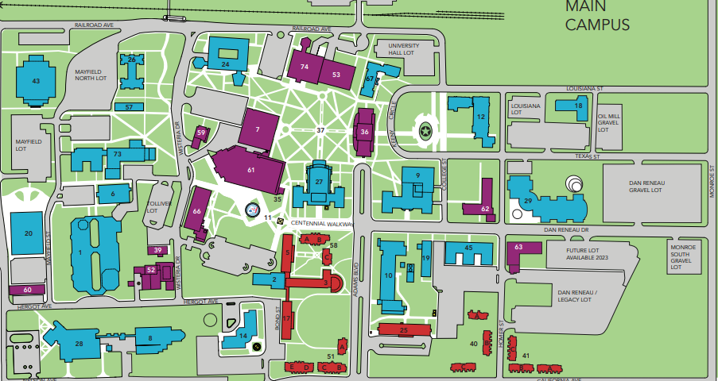

# StudySensor

### CSC 132 Freshman Final Project
### Louisiana Tech University
### Spring Quarter 2024

For our design project, we needed to come up with a product that used the Le Potato (a pi-alternative), it's GPIO output/input, and an intuitive GUI. We decided to go with a "StudySensor", which utilizes two HR-SC04 Sonic Sensors to detect someone entering a study room. The information is passed from the sensor setup (managed by two instantiations of a single python class) to the "Main" portion of the program, then to the "GUI" portion.
The entirety of the program is written in python, and uses modules Pygame, Pygame-menu, time, and the Pineworkslabs.RPi GPIO scheme.

#### Design
In the design of our project, we thought of campus-wide implementation from the get-go. We modeled our project just with one "room", but the project could be easily be scaled up with many more rooms, a single computational hub, and less costly, network-capable microcontrollers. To scale up a "StudySensor" system would ultimately be inexpensive.

#### Lessons Learned
Here are some lessons learned from our develeopment of the project;
* Having a low-perfomance micontroller, such as the Le Potato, manage an entirety of the GUI, the class system, and the entirety of the computation results a low perfomance program. Our microcontroller gets noticably warm, and our program was noticeibly latent. A higher performance microcontroller is to be desired for a singluar node system with no processing offloaded.
* The HC-SR04 Sonic Sensor was unreliable to work with. It is a sensor that returns the time it takes for a pulse to be received back from being bouced off a surface, but the time returned can be varied heavily, leading to inaccurate calibration. A compatible IR (Infared) distance sensor (and IR led) could be a more reliable but equally cost-effective alternative.

### Collaborators
#### Sensor calibration/main.py + GUI hookup:
* https://github.com/smc118
* https://github.com/pythonswirls
  * Primarily handled the class construction and grueling process of continually calibrating the sonic sensors. We also replaced our sensors last minute, as we discovered one was (likely) shorted. Thank goodness we had spares!
#### GUI:
* https://github.com/JDalfe115
  * Respsonsoble for crafting the beautiful GUI using pygame-menu. Over the course of the project's development, he had personally tried a few other python GUI libs. Pygame-menu proved to be the most straight-forward
 
### Afterword One Year Later (by pythonswirls)
#### Summer Quarter 2025
Writing this one year later, in the process of sprucing up my github portfolio, I'm glad we were given the chance to challenge ourselves. We were able to learn a little about the software development process, and implement the languages/concepts we had been learning into a grounded project in a creative way. Personally, I had never really had the chance to work collaboratively on a project as technical as this (before I was a freshman in college) and I also learned much on how information in a project should be structured so that the communication between collaborators is most effective.

Although at the time we were a little hard on ourselves for not acheiving our standard of a completed product, we all were given the much-needed nudge in the direction of our respective career paths. We realize now that the purpose of Freshamn Design project entirely was to give us a snadbox to learn in without much risk of failure. We had become a bit more accustomed to the technologies utilized by software developers as well; very useful for future projects! 

P.S. take a look at the gallery
